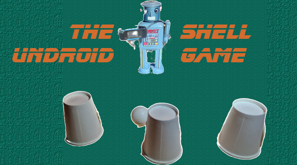

# shell-game

Machine learning and computer vision in a shell game contest

This project is primarily for Oslo Skaperfestival 2023, but is an open-minded machine learning project
intended to test some strategies for using neural networks and computer vision to see if we
can train a machine in the ancient shell game




## Requirements

Built with the new kid on the block - [Zig](https://ziglang.org/) - for speed, tolerance and curiosity.

Zig is a static low level C runner-up, still in its infancy but with great promise!

[OpenCV](https://opencv.org/) is the open source C++ computer vision spearhead, hence C++ wrappers had to be included. These are
blatantly borrowed and adjusted from [zigcv](https://github.com/ryoppippi/zigcv) which unfortunately just became stale. This again
loaned from [gocv](https://gocv.io/) which is a live and well library/wrapper for using OpenCV with the other language of preference - go.

Other technologies are in the machine learning sphere :

YOLO - you only look once - v8, which is the current model training format of choice

Autodistill - a self-labeling package on top of PyTorch, which is a python training and data modeling framework for neural networks
developed by Ultralytics and Torchvision.

## Prerequisites

You will, of course, [need Zig](https://ziglang.org/learn/getting-started/).

You will need OpenCV v4.8.0 installed with development headers.

You will need a YOLO v8 model file, in ONNX format. I prepare mine with movie and autodistillation.
To be documented soon.

## OpenCV install

On linux, the best approach is actually: download OpenCV source and build with Zig:

```
mkdir ~/opencv_build && cd ~/opencv_build
git clone https://github.com/opencv/opencv.git
git clone https://github.com/opencv/opencv_contrib.git

curl -Lo opencv.zip https://github.com/opencv/opencv/archive/refs/tags/$(OPENCV_VERSION).zip
unzip -q opencv.zip
curl -Lo opencv_contrib.zip https://github.com/opencv/opencv_contrib/archive/refs/tags/$(OPENCV_VERSION).zip
unzip -q opencv_contrib.zip
rm opencv.zip opencv_contrib.zip

mkdir -p build && cd build

CC="zig cc" CXX="zig c++" cmake \
    -D CMAKE_BUILD_TYPE=RELEASE \
    -D WITH_IPP=OFF \
    -D WITH_OPENGL=OFF \
    -D WITH_QT=OFF \
    -D CMAKE_INSTALL_PREFIX=/usr/local \
    -D OPENCV_EXTRA_MODULES_PATH=../../opencv_contrib/modules/ \
    -D OPENCV_ENABLE_NONFREE=ON \
    -D WITH_JASPER=OFF \
    -D WITH_TBB=ON \
    -D BUILD_DOCS=OFF \
    -D BUILD_EXAMPLES=OFF \
    -D BUILD_TESTS=OFF \
    -D BUILD_PERF_TESTS=OFF \
    -D BUILD_opencv_java=NO \
    -D BUILD_opencv_python=NO \
    -D BUILD_opencv_python2=NO \
    -D BUILD_opencv_python3=NO \
    -D OPENCV_GENERATE_PKGCONFIG=ON \
    ..

make -j8
make preinstall
sudo make install
sudo ldconfig
```

## Build and run

    zig build

    zig-out/bin/shell-game [camera id] [.onnx model file]
